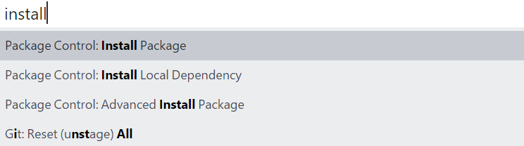

在写 Markdown 时，比较难的是把图片粘贴保存到本地，或上传到服务器。
本文提供一个简单的方式可以把剪贴板的图片粘贴保存本地。

<!--more-->


<!-- CreateTime:2018/5/22 15:15:26 -->

<!-- csdn -->

首先需要下载代码，打开 https://github.com/dotnet-campus/imagepaste 然后下载代码，可以使用 git 的方式下载

然后点击 SublimeText 的 Preference ，点击 Browse Package ，这时会弹出一个文件夹，文件夹的路径是`C:\Users\用户名\AppData\Roaming\Sublime Text 3\Packages`

在 SublimeText 安装包 imagepaste ，安装的方法是按下 ctrl+shift+p 然后输入 install ，选择 PackageControl：Install Package ，这时需要等一下才会出现弹出的输入。在弹出的输入，输入 imagepaste 就可以成功安装。

 

在安装完成之后，从刚才打开的文件夹可以看到 ImagePaste 文件夹，把下载下来的文件替换这个文件夹的文件就可以了。

这时尝试截图，然后粘贴，可以看到显示是

```csharp
 
```

如果需要修改保存的文件路径，那么需要修改 ImagePaste.py 文件，在开始修改，希望你有一些 py 开发的经验，如果没有的话，可能看不懂我在写什么

保存的路径在 get_filename 函数里面写，所以打开 get_filename 函数可以看到下面代码

```python
def get_filename(self):
		view = self.view
		filename = view.file_name()

		# create dir in current path with the name of current filename
		dirname, _ = os.path.splitext(filename)

		# create new image file under currentdir/filename_without_ext/filename_without_ext%d.png
		fn_without_ext = os.path.basename(dirname)
		gitbook_dir = os.path.split(dirname)[0]+'\\image\\'+fn_without_ext

		if not os.path.lexists(gitbook_dir):
			os.mkdir(gitbook_dir)

		i = 0
		while True:
			# relative file path
			rel_filename = os.path.join("%s/%s%d.png" % ("image/"+fn_without_ext, fn_without_ext, i))
			# absolute file path
			abs_filename = os.path.join(gitbook_dir, "%s%d.png" % ( fn_without_ext, i))
			if not os.path.exists(abs_filename):
				break
			i += 1

		print("save file: " + abs_filename + "\nrel " + rel_filename)
		return abs_filename, rel_filename
```

这里的 gitbook_dir 就是用来保存图片的绝对路径，rel_filename 就是用来放在文本的相对路径。

从代码`gitbook_dir = os.path.split(dirname)[0]+'\\image\\'+fn_without_ext` 可以把路径修改为 `os.path.split(dirname)[0]`文件所在文件夹路径下的 Image 文件夹的 `fn_without_ext` 去掉文件后缀名的文件夹。

从`rel_filename = os.path.join("%s/%s%d.png" % ("image/"+fn_without_ext, fn_without_ext, i))`可以拿到合并了`image`文件夹和`fn_without_ext`去掉后缀名的文件名作为文件夹的相对路径，所以里面的修改就十分简单了

例如我需要把代码修改保存在 assets 文件夹下，不需要加上文件名的文件夹，例如

```csharp
assets/xx0.png
```

那么可以这样修改

```csharp
		gitbook_dir = os.path.split(dirname)[0]+'\\assets'

```

```csharp
rel_filename = os.path.join("%s/%s%d.png" % ("assets/", fn_without_ext, i))
```


