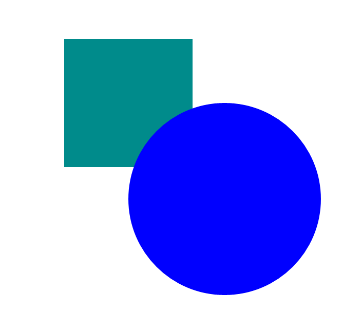
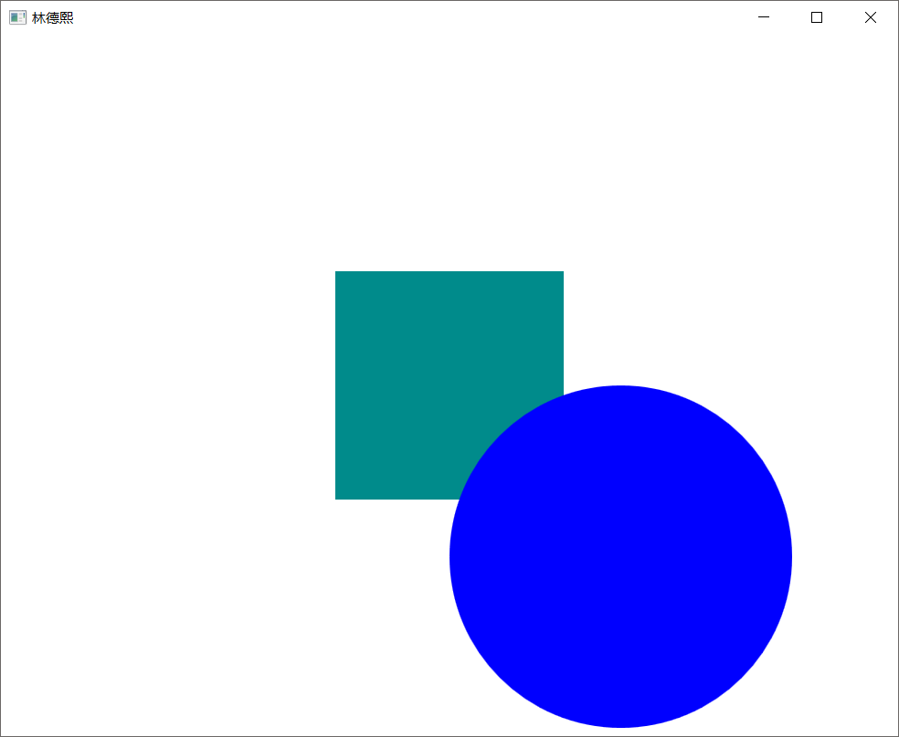

我尝试在一个宽度200高度200的 Canvas 放了一个宽度 300 高度 300 的元素，这个元素会不会被 Canvas 裁剪了？
经过我的测试，发现默认是不会被裁剪

<!--more-->


<!-- CreateTime:2018/8/10 19:16:50 -->


火火问了我一个问题，如果有一个元素超过了 Canvas 的大小，会不会被 Canvas 裁剪。我在自己的项目写了一下，发现会被裁剪，于是就告诉他。

但是这时[walterlv](https://walterlv.github.io/ )师傅拿了一个呆磨，发现不会被裁剪，请看下面代码

```csharp
        <Canvas Height="200" Width="200" HorizontalAlignment="Center" VerticalAlignment="Center" Background="DarkCyan">
            <Ellipse Height="300" Width="300" Fill="Blue" Margin="100,100,100,100" />
        </Canvas>
```

这里的 Canvas 的颜色是 DarkCyan 而里面放一个宽度和告诉都比 Canvas 大的元素，而且颜色是蓝色，这时就看可以看到会不会被裁剪，运行可以看到下面界面

<!--  -->


如图，可以看到超过 Canvas 的元素不会被裁剪

那么为什么本渣的设备使用了超过 Canvas 的元素就会被裁剪？

因为我使用的是以前的项目里面写的，这个项目里面是因为使用了`Clip`的原因，修改清真的代码请看下面

```csharp
        <Canvas Height="200" Width="200" HorizontalAlignment="Center" VerticalAlignment="Center" Background="DarkCyan">
            <Canvas.Clip>
                <RectangleGeometry Rect="0,0,200,200"></RectangleGeometry>
            </Canvas.Clip>
            <Ellipse Height="300" Width="300" Fill="Blue" Margin="100,100,100,100" />
        </Canvas>
```

原先项目之所以没有发现 Clip 是因为我把他写在了样式，所以就没找到，运行项目可以看到下面界面

<!--  -->


那么在 WPF 是怎样呢？

在 WPF 默认也是不会裁剪，请看下面代码

```csharp
        <Canvas Height="200" Width="200" HorizontalAlignment="Center" VerticalAlignment="Center" Background="DarkCyan">
            <Ellipse Height="300" Width="300" Fill="Blue" Margin="100,100,100,100" />
        </Canvas>
```

可以看到在 WPF 的代码和在 UWP 的代码是完全一样的，这时运行一下，和 UWP 界面一样

<!--  -->


