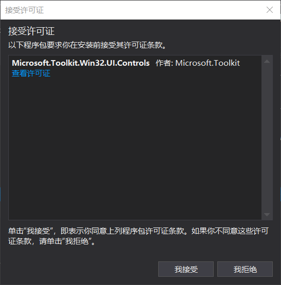
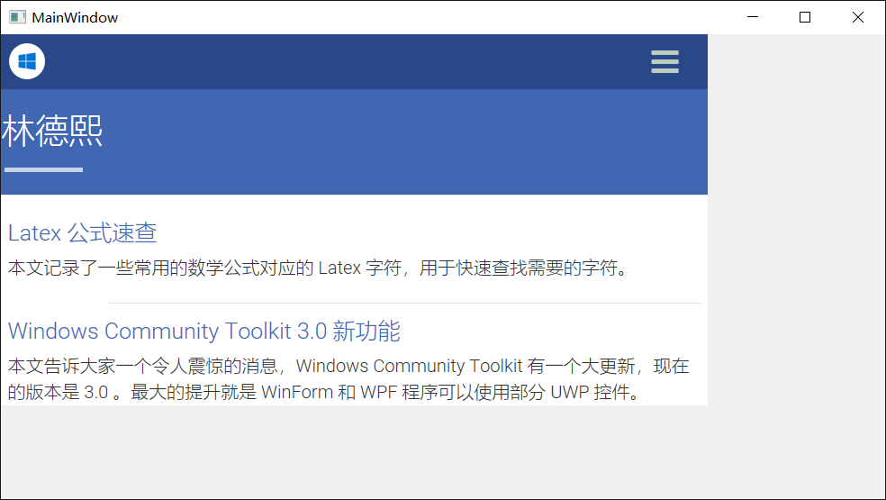
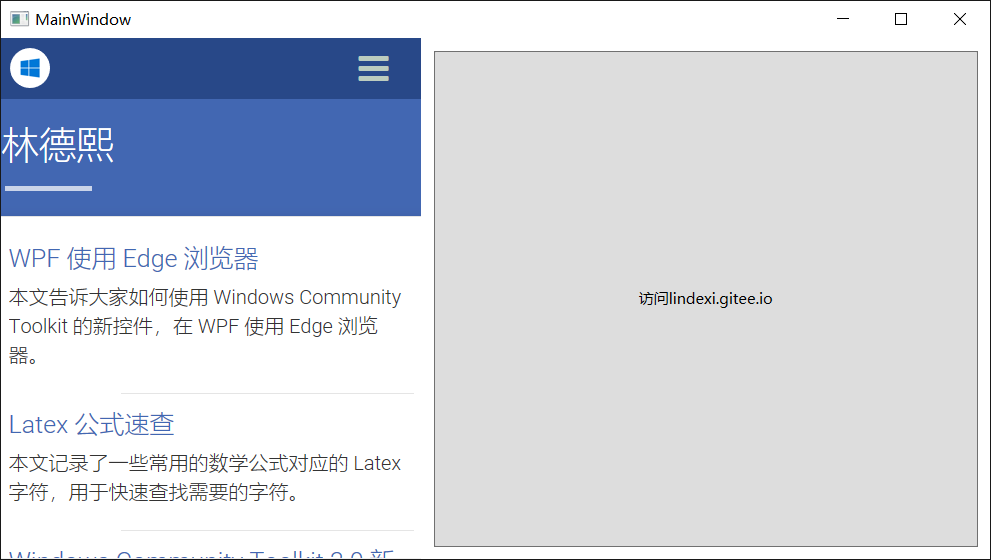
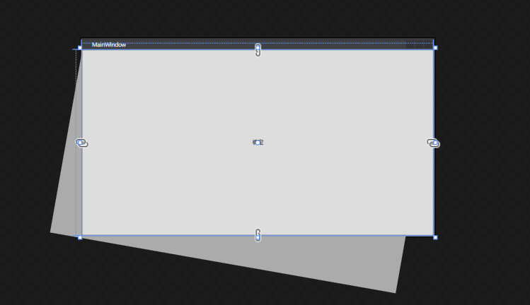
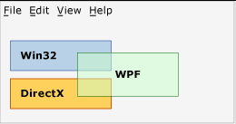
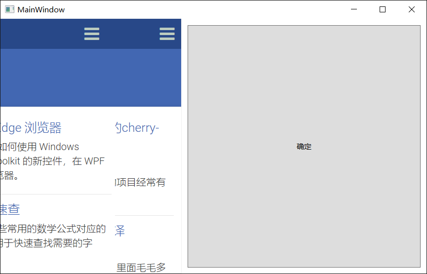

本文告诉大家如何使用 Windows Community Toolkit 的新控件，在 WPF 使用 Edge 浏览器

<!--more-->


<!-- CreateTime:2018/8/13 15:33:05 -->


首先需要通过 VisualStudio 创建 WPF 项目。因为  Microsoft.Toolkit.Win32.UI.Controls 库只支持 4.6.2 以上，所以需要选择框架大于 4.6.2 

打开 Nuget 安装 Microsoft.Toolkit.Win32.UI.Controls ，需要同意许可


<!--  -->


打开主页面，在 xaml 添加下面代码

```csharp
 xmlns:wpf="clr-namespace:Microsoft.Toolkit.Win32.UI.Controls.WPF;assembly=Microsoft.Toolkit.Win32.UI.Controls" 
```

```csharp
        <wpf:WebView x:Name="WebView"></wpf:WebView>
```

在代码跳转到我的博客

```csharp
        public MainWindow()
        {
            InitializeComponent();

            WebView.Navigate("https://lindexi.gitee.io");
        }
```

运行一下软件

<!--  -->


如果不想在 xaml 写任何的代码，也可以通过下面代码添加

```csharp
        public MainWindow()
        {
            InitializeComponent();

            var webView = new WebView();
            webView.Navigate("https://lindexi.gitee.io");
            Content = webView;
        }
```

## 优点

 - 触摸非常流畅

 - 加载页面非常快

 - 缩放页面几乎不使用CPU

 - 对于很多图片的时候使用内存很小

 - 可以使用 RenderTransform 修改显示，但不是所有的变换都可以使用

 - 可以进行布局，如下图，使用Grid分开按钮

 <!--  -->

  

## 存在的问题

 - 吃掉了 Touch 事件、MouseDown事件，也就是吃掉了所有用户输入

 - 第一次加载无法覆盖控件大小，在修改窗口大小之后才可以

 - 设置 IsEnable 无作用

 - 设置 IsHitTestVisible 无作用，依然可以响应输入

 - 默认没有设置 IsManipulationEnable ，但是可以响应手势

 - 能够使用 snoop 在视觉树找到 WebView 但是没有看到 WebView 里面的元素

### 无法在 WebView 上面放控件

我尝试了下面的代码，虽然设计的界面可以看到按钮，但是运行界面没有按钮

```csharp
   <Grid x:Name="Grid">
        <wpf:WebView x:Name="WebView">

            <wpf:WebView.RenderTransform>
                <RotateTransform x:Name="BupeLesedaicee" Angle="10"></RotateTransform>
            </wpf:WebView.RenderTransform>
        </wpf:WebView>
        <TextBlock Text="林德熙都比"></TextBlock>
        <Button Content="确定" 
                Click="Button_OnClick"></Button>
    </Grid>
```

<!--  -->


但是运行的时候就看不到按钮了，所以存在层级问题，这个问题是在08年就有大神说到的问题。

大概就是如果同时有多个渲染，WPF 、 WinForms 如果两个绘制的矩形有重叠，那么重叠部分就不能正常使用。

<!--  -->


无论在什么层级放 WebView ，他的层级都是窗口最高

这个问题参见：[Mitigating Airspace Issues In WPF Applications – Presentation Source](https://blogs.msdn.microsoft.com/dwayneneed/2013/02/26/mitigating-airspace-issues-in-wpf-applications/ )

一个解决方法是：[chris84948/AirspaceFixer: AirspacePanel fixes all Airspace issues with WPF-hosted Winforms.](https://github.com/chris84948/AirspaceFixer )

### 旋转

我尝试使用下面的代码让 WebView 旋转，但是设置值只能让他偏移

```csharp
   <Grid x:Name="Grid">
        <Grid.ColumnDefinitions>
            <ColumnDefinition Width="337*"/>
            <ColumnDefinition Width="456*"/>
        </Grid.ColumnDefinitions>

        <wpf:WebView x:Name="WebView" Grid.Column="0" >

            <wpf:WebView.RenderTransform>
                <RotateTransform x:Name="BupeLesedaicee" Angle="10"></RotateTransform>
            </wpf:WebView.RenderTransform>
        </wpf:WebView>
        <TextBlock Grid.Column="0" Text="lindexi" HorizontalAlignment="Center" VerticalAlignment="Center"></TextBlock>
        <Button Content="确定" 
                Click="Button_OnClick" Grid.Column="1" Margin="10,10,10,10"></Button>
    </Grid>
```

按钮点击的时候就添加旋转

```csharp
        private void Button_OnClick(object sender, RoutedEventArgs e)
        {
            BupeLesedaicee.Angle += 5;
        }
```

<!--  -->


### 添加多个浏览器

如果在相同矩形区域添加多个浏览器，在逻辑树第一个浏览器显示在最前

我在代码打开了我的博客和[黄腾霄](https://huangtengxiao.gitee.io/ )博客，结果发现我的博客显示在前面

```csharp

        <wpf:WebView x:Name="WebView" Grid.Column="0" >

            <wpf:WebView.RenderTransform>
                <RotateTransform x:Name="BupeLesedaicee" Angle="10"></RotateTransform>
            </wpf:WebView.RenderTransform>
        </wpf:WebView>
        <wpf:WebView Grid.Column="0" Source="https://huangtengxiao.gitee.io/"></wpf:WebView>
```

<!--  -->


我尝试使用 `Panel.ZIndex` 但是无法修改顺序

最简单的方法是对比一下原来的浏览器和新的浏览器

```csharp
    <Grid>
        <Grid.ColumnDefinitions>
            <ColumnDefinition Width="337*" />
            <ColumnDefinition Width="456*" />
        </Grid.ColumnDefinitions>

        <wpf:WebView x:Name="WebView" Grid.Column="0" Source="https://lindexi.gitee.io" />

        <WebBrowser Grid.Column="1" Source="https://huangtengxiao.gitee.io/" />
    </Grid>
```

可以看到新的浏览器还是比以前的好很多

参见：[Windows Community Toolkit 3.0 新功能 在WinForms 和 WPF 使用 UWP 控件 - CSDN博客](https://blog.csdn.net/lindexi_gd/article/details/80533053 )

[Bringing a modern WebView to your .NET WinForms and WPF Apps - Microsoft Edge Dev BlogMicrosoft Edge Dev Blog](https://blogs.windows.com/msedgedev/2018/05/09/modern-webview-winforms-wpf-apps/#gUx8ACTB19D37Sdj.97 )

