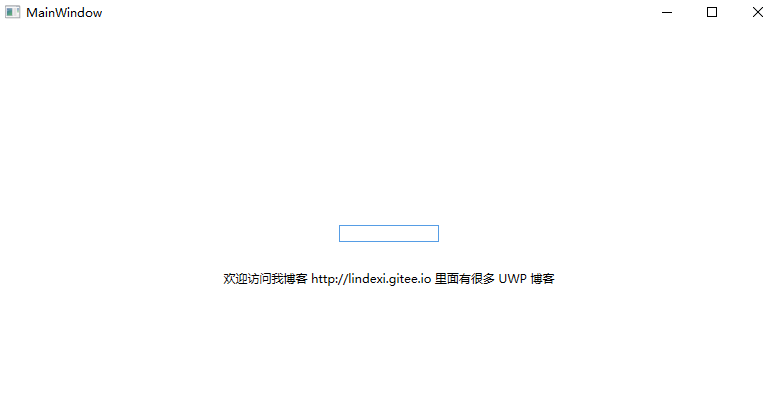
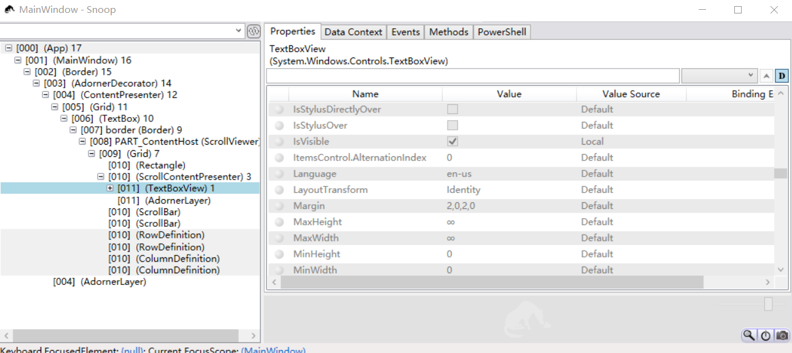
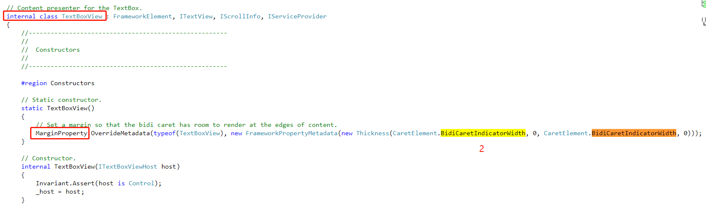
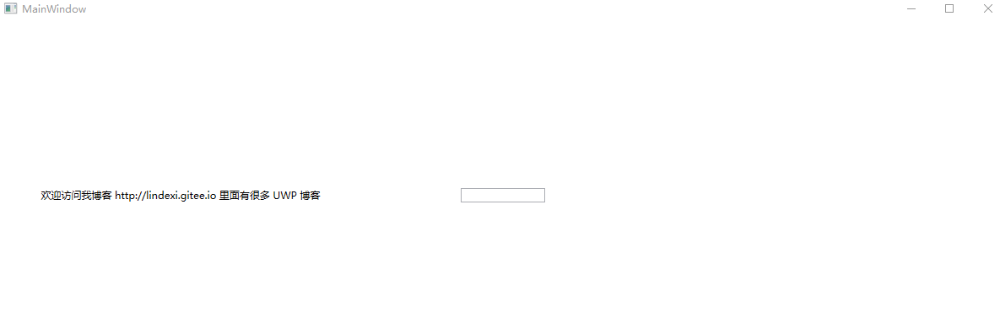

在 WPF 的 TextBox 里有 TextBoxView 用来渲染 TextBox 内容，但是在 TextBox 里面的 TextBoxView 是不能直接设置而且默认的 Margin 是 2,0,2,0 如何自定义这个值

<!--more-->


<!-- CreateTime:2018/9/28 17:16:17 -->

<!-- csdn -->

先来写一个简单的程序告诉大家这个问题，创建一个空白 WPF 程序，在里面添加一个 TextBox 设置 TextBox 居中

```csharp
        <TextBox Width="100" HorizontalAlignment="Center" VerticalAlignment="Center">

        </TextBox>

        <TextBlock Margin="10,100,10,10" Text="欢迎访问我博客 http://lindexi.gitee.io 里面有很多 UWP 博客" HorizontalAlignment="Center" VerticalAlignment="Center"></TextBlock>
```

<!--  -->


可以看到现在的 TextBox 光标和 TextBox 的左边有 2 像素的距离，通过 Snoop 可以看到这个 TextBoxView 的 Margin 是 2,0,2,0 而且无法直接修改

<!--  -->


从 WPF 的源代码可以看到 TextBoxView 是 internal 的也就是无法直接修改 Style 在构造函数设置了 Margin 的值，这里的 CaretElement.BidiCaretIndicatorWidth 就是 2 这就是默认的大小

<!--  -->


最简单的解决方法是通过设置 TextBox 的 Padding 的方法

```xml
        <TextBox Width="100" Padding="-2,0,-2,0" HorizontalAlignment="Center" VerticalAlignment="Center">

        </TextBox>
```

因为在 TextBox 里面存在 TextBoxView 的偏移，使用相反的值可以让 TextBoxView 的偏移取消，这里的 Padding 需要根据自己的需要设置

如果设置 Padding 的负数比较小，如 `-500` 就可以在 TextBox 的外面输入

<!--  -->


如果这里的 TextBox 不是在 ListView 或其他控件使用了 TextBox 的，可以使用自己创建的类继承 TextBox 可以通过在 Load 重写控件的 Margin 重写

```csharp
    public class PeedereJiyay : TextBox
    {
        /// <inheritdoc />
        public PeedereJiyay()
        {
            Loaded += PeedereJiyay_Loaded;
        }

        private void PeedereJiyay_Loaded(object sender, RoutedEventArgs e)
        {
            if (Template.FindName("PART_ContentHost", this) is ScrollViewer contentHost && contentHost.Content != null && contentHost.Content is FrameworkElement textBoxView)
            {
            	// 这里解决 TextBoxView 的 Margin 不能设置
                textBoxView.Margin = new Thickness(0, 0, 0, 0);
            }
        }
    }
```

现在修改一下界面，在界面使用创建的 PeedereJiyay 替换原来的控件

```csharp
        <local:PeedereJiyay Width="100" HorizontalAlignment="Center" VerticalAlignment="Center">

        </local:PeedereJiyay>
```

只要是单独使用文本，可以尝试继承 TextBox 的类。如果是使用其他控件，建议使用修改 Padding 的方法

[c# - How to set the margin on a internal TextBoxView in wpf - Stack Overflow](https://stackoverflow.com/questions/19979523/how-to-set-the-margin-on-a-internal-textboxview-in-wpf )

