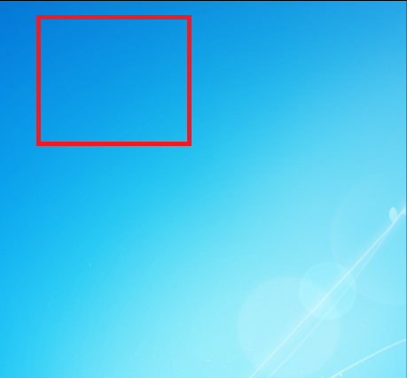

今天有小伙伴问我一个问题，在image控件用鼠标拖拽出矩形，本文告诉大家如何使用鼠标画出矩形

<!--more-->


<!-- CreateTime:2018/11/19 15:35:13 -->


做出来的效果先请大家看一下

<!--  -->


最简单的方法是在 Down 的时候记录按下的点，在 移动的时候重新计算所在的宽度

<!--  -->


先在界面使用一个图片和一个矩形

```csharp
    <Grid x:Name="Grid">
        <Image Source="TIM截图20180811150831.png"></Image>
        <TextBlock HorizontalAlignment="Center" VerticalAlignment="Center">欢迎访问我博客 http://lindexi.oschina.io </TextBlock>
        <Rectangle x:Name="Rectangle" StrokeThickness="2" Stroke="Black" HorizontalAlignment="Left" VerticalAlignment="Top"></Rectangle>
    </Grid>
```

需要注意，图片的位置需要修改为自己需要的图片

这里的 `Rectangle` 需要做一些设置，主要 `HorizontalAlignment` 和 `VerticalAlignment` 必须设置为左上角

现在打开 cs 代码，在按下和移动修改矩形

```csharp

            MouseDown += MainWindow_MouseDown;
            MouseMove += MainWindow_MouseMove;
            MouseUp += MainWindow_MouseUp;
```

需要两个字段来记录当前是否按下和第一次按下所在的坐标

刚才给 `Grid` 的命名就是为了拿到相对 Grid 的坐标

```csharp
        private void MainWindow_MouseDown(object sender, MouseButtonEventArgs e)
        {
            _started = true;

            _downPoint = e.GetPosition(Grid);
        }

        private bool _started;

        private Point _downPoint;
```

在鼠标按下时拿到按下的坐标，通过这个坐标就可以计算出矩形所在的位置

```csharp
        private void MainWindow_MouseUp(object sender, MouseButtonEventArgs e)
        {
            _started = false;
        }

        private void MainWindow_MouseMove(object sender, MouseEventArgs e)
        {
            if (_started)
            {
                var point = e.GetPosition(Grid);

                var rect = new Rect(_downPoint, point);
                Rectangle.Margin = new Thickness(rect.Left, rect.Top, 0, 0);
                Rectangle.Width = rect.Width;
                Rectangle.Height = rect.Height;
            }
        }
```

代码就是这么简单，通过修改 `Margin` 的方法修改矩形

如果对于高手，我建议使用 `RenderTransform` 的方式而不是使用 `Margin` 这里使用这个方法只是看起来简单

因为性能最差 Canvas.SetLeft Canvas.SetTop，性能中等 Margin，性能最好 RenderTransform 当然使用 RenderTransform 的方法没有使用 Margin 那样容易了解


