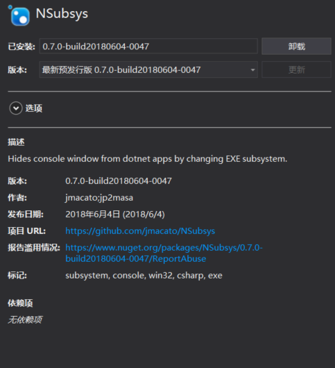

在带界面的 dotnet core 程序运行的时候就会出现一个控制台窗口，本文告诉大家使用最简单方法去隐藏控制台窗口。

<!--more-->

<!-- csdn -->
<!-- 标签：Avalonia,Roslyn -->

最近在使用 Avalonia 开发，这是一个支持 dotnet framework 和 dotnet core 的框架，在开发的过程发现启动的窗口居然会出现控制台窗口。

在 VisualStudio 2017 的格式，如果是 dotnet framework 的程序，在没有设置 `OutputType` 为 `WinExe` 的是时候，启动程序会显示一个控制台窗口。

虽然在 dotnet framework 程序可以简单通过设置`OutputType` 为 `WinExe` 解决。如果这时使用跨平台多项目，就会看到 dotnet core 项目依旧会显示黑色窗口

最简单的方法是通过修改 PE 文件的方式，在 [NSubsys](https://github.com/jmacato/NSubsys/blob/master/NSubsys.csproj )就是编写了一个 Task 用来在编译完成获取 Exe 修改 PE 文件格式，隐藏黑色窗口

安装 [NSubsys](https://github.com/jmacato/NSubsys/blob/master/NSubsys.csproj ) 的方法就是从 Nuget 搜索 [NSubsys](https://github.com/jmacato/NSubsys/blob/master/NSubsys.csproj ) 然后使用 `dotnet publish `一下就可以了

<!--  -->

如果想知道为什么你安装了一个 Nuget 就可以帮你修改请看[如何创建一个基于 MSBuild Task 的跨平台的 NuGet 工具包 - walterlv](https://walterlv.github.io/post/create-a-cross-platform-msbuild-task-based-nuget-tool.html )

