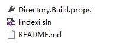

我找了很久没有发现 SolutionDir 这个定义，所以只能通过一个不通用的方法找到

<!--more-->


<!-- CreateTime:2019/7/22 8:57:14 -->

<!-- csdn -->

<!-- 标签：Roslyn,MSBuild,编译器 -->


在之前的项目可以使用 PreBuildEvent 的方式指定编译之前事件，新的项目格式也可以支持这个方法，只是支持不是很好

我就遇到在 Jenkins 无法编译通过，因为 PreBuildEvent 指定的 `$(SolutionDir)` 是空

在新的项目格式，找了很久都没有找到 `$(SolutionDir)` 的定义和找到运行的 sln 文件的定义的方法

于是通过 [Directory.Build.props](https://lindexi.oschina.io/lindexi/post/Roslyn-%E4%BD%BF%E7%94%A8-Directory.Build.props-%E6%96%87%E4%BB%B6%E5%AE%9A%E4%B9%89%E7%BC%96%E8%AF%91.html ) 的方法找到 sln 文件

<!--  -->

在 sln 文件所在的文件夹添加 Directory.Build.props 文件，因为很多项目的 sln 都在项目的最外，所以通过这个方法找到 sln 是可以的，只是不通用

如我有一个项目 lindexi 这个项目的文件夹请看下图

```csharp
|   Directory.Build.props
|   lindexi.sln
|   README.md
|
\---src
        lindexi.csproj
```

在 Directory.Build.props 添加下面代码

```csharp
<Project>
  <PropertyGroup>
    <SolutionDir>$(MSBuildThisFileDirectory)</SolutionDir>
  </PropertyGroup>
</Project>

```

因为 `$(MSBuildThisFileDirectory)` 就是当前的文件的文件夹，这个文件和 sln 文件刚好在相同的文件夹，所以通过这个方法就可以获得 sln 所在的文件夹

[项目文件中的已知属性（知道了这些，就不会随便在 csproj 中写死常量啦） - walterlv](https://blog.walterlv.com/post/known-properties-in-csproj.html )

[MSBuild Well-known Item Metadata](https://docs.microsoft.com/en-us/visualstudio/msbuild/msbuild-well-known-item-metadata?view=vs-2017 )

[MSBuild Reserved and Well-known Properties](https://docs.microsoft.com/en-us/visualstudio/msbuild/msbuild-reserved-and-well-known-properties?view=vs-2017 )

更多请看 [手把手教你写 Roslyn 修改编译](https://lindexi.oschina.io/lindexi/post/roslyn.html )


