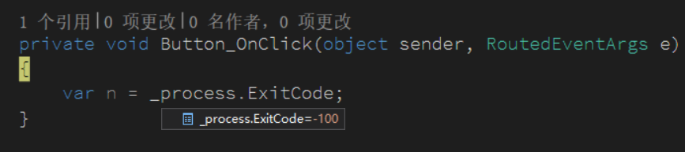

我需要写一个程序，让这个程序知道另一个程序是否正常退出，于是就需要获取这个进程的退出代码

<!--more-->


<!-- CreateTime:2019/8/31 16:55:58 -->


在程序如果需要手动退出，可以设置当前的退出代码

```csharp
        static void Main(string[] args)
        {
            Environment.Exit(-100);
        }
```

这时的程序运行就退出，同时退出的代码就是 -100 这和 C 语言的在 main 函数返回值一样

在 C# 如果想要实现 C 语言的 main 函数的返回值，是通过调用 Environment.Exit 方法

那么其他程序如何拿到这个程序的退出代码？

需要其他程序先拿到这个程序的进程，如果是在其他程序启动这个程序，那么通过 Process 就可以拿到


如我有两个程序，一个是控制台程序，这个控制台程序是 控制台.exe 还有一个 WPF 程序，通过 WPF 程序打开控制台程序，然后拿到控制台程序的退出代码

```csharp
        private Process _process;

        public MainWindow()
        {
            InitializeComponent();
            var process = new Process {StartInfo = new ProcessStartInfo("控制台.exe")};
            _process = process;
            process.Start();
        }
```

在 WPF 程序的按钮按下尝试通过 `_process.ExitCode ` 请看代码

<!--  -->


通过这个方法就可以拿到启动的进程的返回值，如果不是在 WPF 启动控制台程序，也可以在进程退出之前使用下面代码拿到进程

```csharp
 var process = Process.GetProcessById(控制台进程);
```

如果在进程退出之后才尝试去获取进程就会出现下面代码

```csharp
System.ArgumentException:“ID 为 xx 的进程当前未运行。”
```

