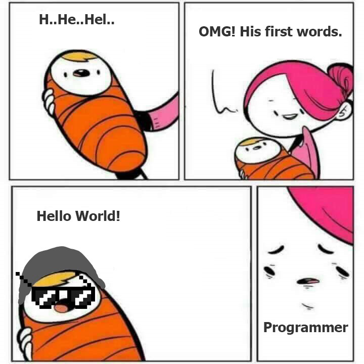

本文收集我在各个网站看到的程序员笑话。

<!--more-->

<!-- CreateTime:2019/9/2 12:57:38 -->

<!-- csdn -->

## 烧烤

两个程序员去烧烤

A: 我不记得带烧烤架了

B：我有办法

## 一半实话

产品经理：有黑客入侵了系统，盗取了用户信息。现在需要你发一个版本说明这个问题，并且说这个事情再也不会发生。

程序员：发布的声明是真的么？// 这件事情再也不会发生是真的？

产品经理：至少一半是真的

程序员：那些是真的？

产品经理：有黑客入侵了系统，盗取了用户信息

## 程序员重生

<!--  -->

C:H..He..Hel

A:我的天，这是他的第一句话

C: Hello World // 程序员练手的第一句话

A: 一脸嫌弃，这是一个程序员

