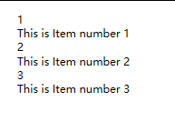

本文告诉大家如何通过修改 ItemContainerStyle 让 ListView 或 ListBox 的选择效果如鼠标移动到未选中项的效果或选择项的背景

<!--more-->


<!-- CreateTime:2018/12/1 8:18:33 -->

<!-- csdn -->

先写一些简单的代码用于界面的绑定

```csharp
    public partial class MainWindow : Window
    {
        public MainWindow()
        {

            InitializeComponent();
            DataContext = this;
            Items = new List<Item> { new Item(1), new Item(2), new Item(3) };
        }

        public List<Item> Items { get; set; }
    }

    public class Item
    {
        public Item(int id)
        {
            Id = id;
        }

        public int Id { get; set; }
        public string Text { get => $"This is Item number {Id}"; }
    }
```

在界面放一个 ListView 默认在鼠标移动到没有被选择的项的时候会出现背景

```csharp
            <ListView ItemsSource="{Binding Items}">
                <ListView.ItemTemplate>
                    <DataTemplate DataType="local:Item">
                        <StackPanel>
                            <TextBlock Text="{Binding Id}" />
                            <TextBlock Text="{Binding Text}" />
                        </StackPanel>
                    </DataTemplate>
                </ListView.ItemTemplate>
            </ListView>
```

通过写样式在 ItemContainerStyle 可以让 ListView 的在鼠标移动到未选择项的特效的颜色修改

```xml
       <!-- set SelectedBackgroundColor to Transparent when you do not need the background in selected items -->
        <Color x:Key="SelectedBackgroundColor">#00FFFFFF</Color>
        <Color x:Key="SelectedUnfocusedColor">#FFB2A3A2</Color>

        <!-- set the MouseOverColor to Transparent when you do not need the effect in the unselected items -->
        <Color x:Key="MouseOverColor" >#00FFFFFF</Color>

        <Style x:Key="ListViewItemStyle"
               TargetType="ListViewItem">
            <Setter Property="SnapsToDevicePixels"
                    Value="true" />
            <Setter Property="OverridesDefaultStyle"
                    Value="true" />
            <Setter Property="Template">
                <Setter.Value>
                    <ControlTemplate TargetType="ListBoxItem">
                        <Border x:Name="Border"
                                Padding="2"
                                SnapsToDevicePixels="true"
                                Background="Transparent">
                            <VisualStateManager.VisualStateGroups>
                                <VisualStateGroup x:Name="CommonStates">
                                    <VisualState x:Name="Normal" />
                                    <VisualState x:Name="MouseOver" >
                                        <Storyboard>
                                            <ColorAnimationUsingKeyFrames Storyboard.TargetName="Border"
                                                                          Storyboard.TargetProperty="(Panel.Background).
                    (SolidColorBrush.Color)">
                                                <EasingColorKeyFrame KeyTime="0"
                                                                     Value="{StaticResource MouseOverColor}" />
                                            </ColorAnimationUsingKeyFrames>
                                        </Storyboard>
                                    </VisualState>
                                    <VisualState x:Name="Disabled" />
                                </VisualStateGroup>
                                <VisualStateGroup x:Name="SelectionStates">
                                    <VisualState x:Name="Unselected" />
                                    <VisualState x:Name="Selected">
                                        <Storyboard>
                                            <ColorAnimationUsingKeyFrames Storyboard.TargetName="Border"
                                                                          Storyboard.TargetProperty="(Panel.Background).
                    (SolidColorBrush.Color)">
                                                <EasingColorKeyFrame KeyTime="0"
                                                                     Value="{StaticResource SelectedBackgroundColor}" />
                                            </ColorAnimationUsingKeyFrames>
                                        </Storyboard>
                                    </VisualState>
                                    <VisualState x:Name="SelectedUnfocused">
                                        <Storyboard>
                                            <ColorAnimationUsingKeyFrames Storyboard.TargetName="Border"
                                                                          Storyboard.TargetProperty="(Panel.Background).
                    (SolidColorBrush.Color)">
                                                <EasingColorKeyFrame KeyTime="0"
                                                                     Value="{StaticResource SelectedUnfocusedColor}" />
                                            </ColorAnimationUsingKeyFrames>
                                        </Storyboard>
                                    </VisualState>
                                </VisualStateGroup>
                            </VisualStateManager.VisualStateGroups>
                            <ContentPresenter />
                        </Border>
                    </ControlTemplate>
                </Setter.Value>
            </Setter>
        </Style>
```

可以直接使用上面的代码，如果想要让用户看不到鼠标移动到未选中项的特效可以设置 MouseOverColor 为透明，通过设置 SelectedBackgroundColor 可以让选中项的背景修改

因为颜色在 WPF 使用 #AARRBBGG 表示，如上面代码设置了 #00FFFFFF 就是透明，因为第一个 Alpha 为 0 也就是透明

在 ListView 使用刚才写的样式，运行代码可以看到下面图片

```
        <ListView ItemsSource="{Binding Items}"
                  ItemContainerStyle="{StaticResource ListViewItemStyle}">
            <ListView.ItemTemplate>
                <DataTemplate DataType="local:Item">
                    <StackPanel>
                        <TextBlock Text="{Binding Id}" />
                        <TextBlock Text="{Binding Text}" />
                    </StackPanel>
                </DataTemplate>
            </ListView.ItemTemplate>
        </ListView>
```

<!--  -->


https://stackoverflow.com/a/53557393/6116637

